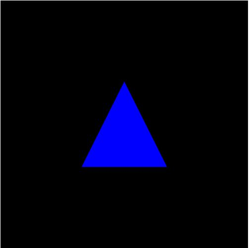
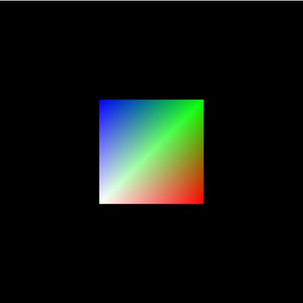
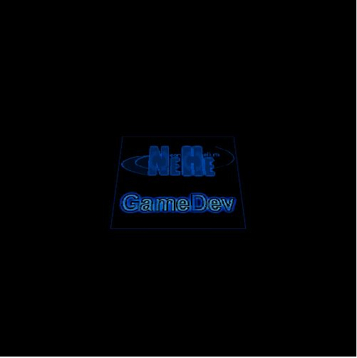
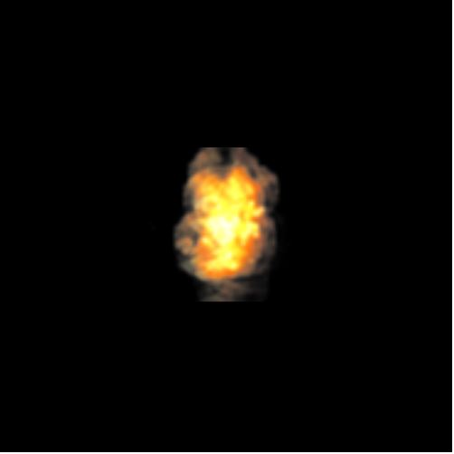
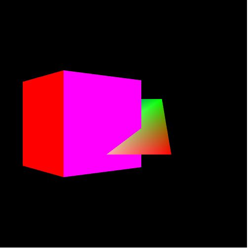

# NativeWebGLExamples

A collection of native WebGL examples written in Typescript, Visual Studio or VSCode.
More detail & running examples can be found @ http://ianwigley.co.uk/index1.html.

#Sample1

#Sample2

#Sample3

#Sample4

#Sample5

#Sample6

#Sample7

